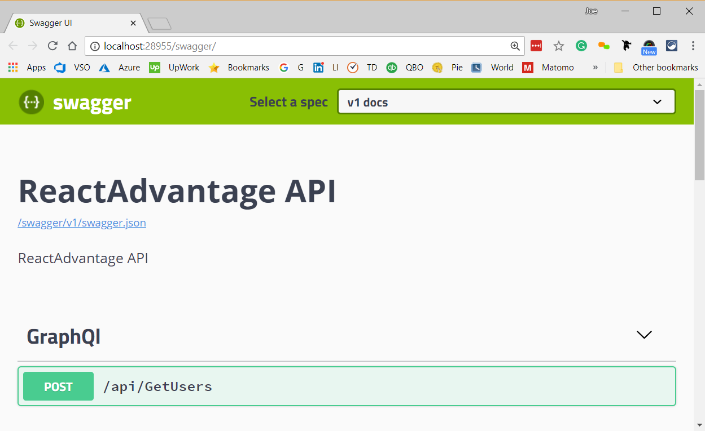
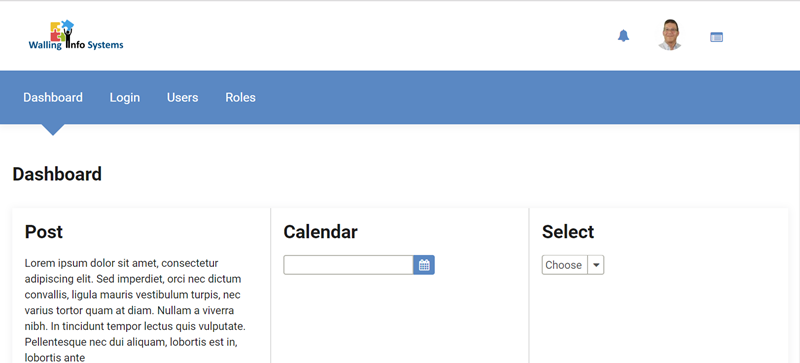

# ReactAdvantage
> ReactAdvantage is a starter kit to make starting your next React project easier so you can focus on the business logic instead of having to worry about the tooling and infrastructure. This project includes nice looking UI components (PrimeReact) and common pages, like login, that most web applications need.

>In addition to making it easy to get started on a project with a well thought out architecture, one main goal was performance. For this reason, Apollo and GraphQL sit between React and ASP.NET Core 2. We are working toward building in Identity Server for authentication and authorization and on making the framework multi-tenant capable. 

## Getting Started

Clone the repo to a local directory. 

This application has 2 parts. The backend components will all be under the server folder and the front end is all under the client folder.

### Service configuration 

Before the web service can be run, you need to configure the database. Since the application is using Entity Framework code first against a SQL Server database, you will need to run the data migrations against the database.

Configure the server name for the database connection string in either user secrets or the appsettings.json file.

After the connection string is configured, run the update-database command in the package manager if you are using Visual Studio. Be sure you have specified the EntityFramework project to run the command against.

```sh
update-database
```

Next, run the application. If all works properly, a browser should open and it will display a Swagger page showing the available services.

Note the port that the service is running on uyour localhost development environment. You will need to be sure to configure it properly on the client. It should default to port 28955.



### Client
The client application and tooling depend on Node and Yarn, so be sure you have a current version of Node and Yarn installed on your development system.

Currently, the frontend uses port 28955 to connect to the service. Shortly, this should be changed to allow you to configure the URI of the web service.

Change to the root directory of the client application, install the JavaScript dependencies, and start the application.

```sh
cd ClientFolderPath
yarn install
yarn start
```
When it finishes compiling you should have a new browser open and should see the sample screens that are available in the application.



### Changing logo
Change the logo by replacing the logo.png file under client\src\assets with your file of that same name.

### Changing colors
While much of the scss will be associated with the pages and components, the overall colors are defined in the variables.scss file in the client\src\global-styles folder. By defining the colors in one place, you can make major changes to your application style in one place.

## Built With

* [PrimeReact](https://www.primefaces.org/primereact/#/) - The UI Components used
* [Apollo](https://www.apollographql.com/) - Connect data to your UI as well as providing tooling and infrastructure for GraphQL queries.
* [GraphQL](https://graphql.org) - a query language for APIs and a runtime for fulfilling those queries with your existing data.
* [Asp.NET Core 2](https://docs.microsoft.com/en-us/aspnet/core/getting-started/?view=aspnetcore-2.1) - the framework the backend application logic is written in.

## Contributing

Please read [CONTRIBUTING.md](codeofconduct.md) for details on our code of conduct, and the process for submitting pull requests to us.

## Versioning

We use [SemVer](http://semver.org/) for versioning. 

## Authors

* **Joe Walling** - *Initial work* - [Walling Info Systems](https://wallingis.com)

See also the list of [contributors](https://github.com/joewalling/reactadvantage/contributors) who participated in this project.

## License

This project is licensed under the MIT License - see the [LICENSE.md](LICENSE.md) file for details

## Acknowledgments

* Hat tip to anyone whose code was used
* Inspiration
* etc